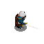

# Moonlighter
A 2D top-down dungeon crawler game written in Java, inspired by the game Moonlighter.

This is a recreation of the game Moonlighter, made back in June, 2023.  

The entire game is written in Java, and utilizes various libraries including JavaAX, JavaAWT, Swing.  
We applied everything we had learned in our ICS4U1 course, from algorithms to Object-Oriented Design to improve maintainability and modularity of our program.  

In addition to that it incorporates custom sounds for various actions, including swinging a sword, defeating an enemy, purchasing a potion, drinking a potion, winning, losing, and taking damage.  
In addition to this, we created custom animations for all the sprites for all the different actions, including dealing damage, and moving (all 4 directions).  

For example here's one of the frames for the lunge attack:  

Developed by [Mustafa](https://www.linkedin.com/in/mustafa-merchant-40ab00285/) and myself during highschool.
